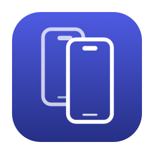

<p align="center">
  
</p>

<h1 align="center">OpenDeviceHub</h1>

<p align="center">
  <strong>Your iOS simulators in windows again, one per device.</strong>
</p>

<p align="center">
  Xcode 27 replaced Simulator.app with Device Hub, and a decade of habits did not come across with
  it. OpenDeviceHub connects to the same simulators Xcode installs and brings back the familiar
  window, scaling and shortcuts, with a command line tool for driving a device from a script.
</p>

<!-- PLACEHOLDER, deliberate: no screenshot has been captured yet. Replace this block with a
     screenshot or a short GIF of a device window, and keep the width attribute. -->
<p align="center">
  <em>A screenshot goes here.</em>
</p>

<p align="center">
  <a href="https://github.com/Mastersam07/OpenDeviceHub/releases">
    
  </a>
</p>

<p align="center">
  <sub>Signed, notarized, and it updates itself.</sub>
</p>

## Install

Download the DMG from [Releases](https://github.com/Mastersam07/OpenDeviceHub/releases), drag
OpenDeviceHub to Applications and launch it. The app is signed with a Developer ID certificate and
notarized, so there is no Gatekeeper warning, and it updates itself from the app menu.

The `odhub` command line tool ships inside the bundle. Choose **OpenDeviceHub → Install Command Line
Tool** and it links `odhub` into a folder already on your `PATH`, asking for your password only if
every such folder belongs to the system. **Remove Command Line Tool** takes it away again.

Then, in a new terminal, `odhub doctor` reports what it found and `odhub list` shows your
simulators.

## Features

- **A window per device**: several simulators side by side, resizable from any edge or corner, full
  screen, keep on top, and each window remembers where you put it.
- **Precise scaling**: Point Accurate, Pixel Accurate, Physical Size or Fit, with the device body
  drawn around the screen or hidden.
- **Opens like an app**: click the icon for whatever is running, or pick a simulator from the Dock
  icon or File → Open Simulator. A device booted anywhere else gets a window here too.
- **Familiar shortcuts**: the Simulator keys you already know.
- **Input**: click to tap and drag, pinch and rotate with the trackpad, type with your Mac
  keyboard, and swipe up from the bottom edge for home or the app switcher. Send keys to the device or
  keep them, connect the Mac keyboard as the device's hardware keyboard, and match its language to
  yours.
- **Device controls**: Home, Lock, volume, rotation, Siri, the Action button and light or dark
  appearance, from the menu or by clicking the buttons on the device body. Restart or erase a device,
  step its text size, turn on increased contrast, trigger an iCloud sync, and set a location from a
  scenario or your own coordinates.
- **Create a simulator**: name it, pick a device type and an OS version, and it boots and opens. The
  two lists follow each other, so a device an installed runtime cannot run is never offered.
- **Screenshots and recordings**: a capture appears beside the window first, where you can open,
  copy, save it elsewhere, reveal it in the Finder or throw it away. Left alone it files itself. The
  folder is yours to choose.
- **The clipboard stays in step**: copy on the Mac and it is on the device; copy on the device and it
  is on the Mac when you switch to another app. Or do it by hand from Edit.
- **Settings**: whether closing a window shuts the device down, whether launching opens the
  simulator you had last, where captures go, and which app opens device links.
- **Drag and drop**: drop a file or a link onto a device to open it there.
- **Follows the device**: shut a simulator down from anywhere and its window says so and offers to
  start it again; boot it and the window reattaches on its own.
- **Debug helpers**: slow animations, shake, simulated memory warning, the system log and app data
  in the Finder, and a click to frame latency overlay.
- **A command line tool**: `odhub` drives a simulator from a script: tap, swipe, pinch, type,
  buttons, rotation. One menu item puts it on your `PATH`.

<details>
<summary>Keyboard shortcuts</summary>

| Keys | Does |
|---|---|
| ⌘1 ⌘2 ⌘3 ⌘4 | Point Accurate, Pixel Accurate, Physical Size, Fit |
| ⌘B | Show device bezel |
| ⌘T | Keep on top |
| ⌃⌘F | Enter full screen |
| ⌘W | Close window |
| ⇧⌘H | Home |
| ⌘L | Lock |
| ⌘↑ ⌘↓ | Volume up, volume down |
| ⌘← ⌘→ | Rotate left, rotate right |
| ⌘S | Save screenshot |
| ⌘R | Record screen |
| ⌘C | Copy screenshot |
| ⌘V | Paste to device |
| ⇧⌘A | Toggle appearance |
| ⌃⌘Z | Shake |
| ⇧⌘L | Show click to frame latency |

</details>

<details>
<summary>Command line</summary>

Every command takes a simulator UDID, which `odhub list` prints. `odhub help <command>` has the full
options.

| Command | Example |
|---|---|
| `doctor` | `odhub doctor` |
| `list` | `odhub list` |
| `view` | `odhub view A1B2C3D4 --boot` |
| `tap` | `odhub tap A1B2C3D4 --x 0.5 --y 0.5` |
| `swipe` | `odhub swipe A1B2C3D4 --from-x 0.5 --from-y 0.8 --to-x 0.5 --to-y 0.2` |
| `pinch` | `odhub pinch A1B2C3D4 --from 0.2 --to 0.7` |
| `type` | `odhub type A1B2C3D4 "hello"` |
| `paste` | `echo hello \| odhub paste A1B2C3D4` |
| `copy` | `odhub copy A1B2C3D4` |
| `button` | `odhub button A1B2C3D4 home` |
| `rotate` | `odhub rotate A1B2C3D4 landscapeLeft` |
| `home-swipe` | `odhub home-swipe A1B2C3D4` |
| `app-switcher` | `odhub app-switcher A1B2C3D4` |

</details>

## Current limitations
- **The windows are invisible to accessibility**: VoiceOver, window managers and scripting tools see
  the app and its menus but not its windows.
- **A device taller than your display** keeps its bottom edge off screen, where the pointer cannot
  reach it. Use Fit.
- **The compact layout below 340 points wide** is written and unit tested but has never been used by
  hand.
- **Other Apple platforms**: tvOS, watchOS and visionOS simulators are not supported.

Want to help close one of these? Pull requests are welcome. [ROADMAP.md](ROADMAP.md) is where that
list is going: location, push, biometrics, proxy certificates, device management, and the project
aware tooling this exists for.

## Working with Device Hub

Xcode 27 opens Device Hub itself when you run an app on a simulator, and other tools may launch it
too. OpenDeviceHub shows the same devices, so both can be on screen at once. Two of Apple's own
settings make them share better.

Quitting Device Hub can shut down the simulators it started, which closes their windows here. To stop
that, quit Device Hub and run:

```sh
defaults write com.apple.dt.Devices shutdownStartedDevicesOnQuit -bool false
```

To stop Xcode opening Device Hub at all, quit Xcode and run:

```sh
defaults write com.apple.dt.Xcode DVTiPhoneSimulatorAlwaysLaunchInCoreSimulatorSession -bool true
```

Xcode then boots the simulator without a window of its own and yours is the one you use. With this
on, boot the device here before pressing Run, or Xcode may shut it down when you press Stop.

**OpenDeviceHub → Settings → Links** offers to open `devices://` links here instead. That covers
links only. Nothing can take over from a tool that launches Device Hub directly, because it is
launched by name rather than through the link.

## Requirements

macOS 14 or later, Apple silicon, and Xcode 26 or 27 with at least one iOS simulator runtime.

Apple silicon only, and not by preference: the simulator frameworks this app loads from Xcode ship
as `arm64e` with no Intel slice, so an Intel build would launch and then fail at the first framework
load.

## Building from source

```sh
scripts/build.sh              # the executables
scripts/build-app.sh release  # build/OpenDeviceHub.app
swift test --package-path engine
```

Use `scripts/build.sh` rather than `swift build` directly: SwiftPM records the deployment target as
the linked SDK version, and AppKit then gives the window its pre macOS 26 appearance. Tests that
need a booted simulator are gated behind `ODH_INTEGRATION=1` and skip otherwise.

Source builds are signed ad hoc and need no Apple account or certificates. They report version
`0.0.0-dev` and carry no update channel, so in-app updates stay off unless an update signing key is
configured and a source build can never replace itself with a release.

## Contributing

Bug reports, feature ideas and pull requests are welcome. A bug report is far more useful with the
output of `odhub doctor`, which names your macOS version, Xcode version, device and runtime.

For a vulnerability, please read [SECURITY.md](SECURITY.md) instead of opening an issue. It also
describes what the app does to your machine, which is worth knowing given it loads private
frameworks out of your Xcode. Maintainers cutting a release want [RELEASING.md](RELEASING.md).

## License

[MIT](LICENSE). The Indigo touch message layout and hardware button constants are adapted from
[idb](https://github.com/facebook/idb) (Meta Platforms, MIT) and the rotation path from Siniulator
(MIT); see [third-party notices](THIRD_PARTY_NOTICES.md).

## Disclaimer

OpenDeviceHub is an independent open source project. It is not affiliated with, endorsed by or
sponsored by Apple Inc.

It bundles no Apple frameworks, simulator runtimes or device bezel assets. It uses your local Xcode
installation and the components installed through it, loaded at runtime.
